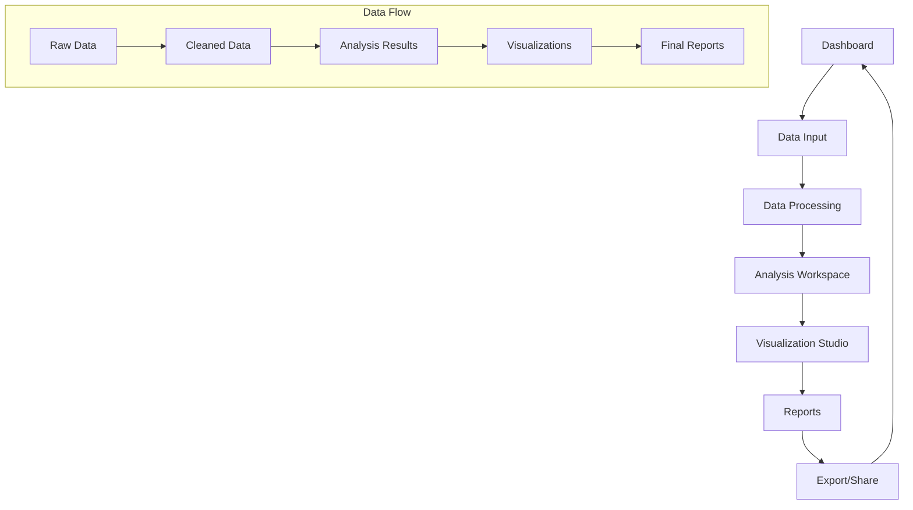

## 1. Product Overview
A comprehensive web-based marketing insights tool that enables businesses to analyze their marketing data through multiple input formats, generate actionable insights with advanced analytics, and visualize results through interactive dashboards. The platform helps marketing teams make data-driven decisions by transforming raw data into meaningful visualizations and recommendations.

## 2. Core Features

### 2.1 User Roles
| Role | Registration Method | Core Permissions |
|------|---------------------|------------------|
| Basic User | Email registration | Upload data, view basic insights, export reports |
| Premium User | Subscription upgrade | Advanced analytics, custom dashboards, API access |
| Enterprise User | Contact sales | Unlimited data processing, white-label reports, team collaboration |

### 2.2 Feature Module
Our marketing insights tool consists of the following main pages:
1. **Dashboard**: Overview of recent analyses, quick stats, navigation to key features.
2. **Data Input**: Multiple input methods including text fields, CSV/Excel upload, and custom objectives.
3. **Analysis Workspace**: Interactive data processing, statistical analysis, and pattern identification.
4. **Visualization Studio**: Dynamic charts, trend graphs, heatmaps, and customizable dashboard views.
5. **Reports**: Generated insights summaries, recommendations, and exportable reports.
6. **Settings**: User preferences, data management, and account configuration.

### 2.3 Page Details
| Page Name | Module Name | Feature description |
|-----------|-------------|---------------------|
| Dashboard | Overview section | Display recent analyses, key metrics, and quick access buttons for common tasks. |
| Dashboard | Quick stats | Show total datasets processed, insights generated, and storage usage. |
| Dashboard | Navigation | Menu access to all main features and user account management. |
| Data Input | Text input | Manual data entry with validation and formatting assistance. |
| Data Input | File upload | Drag-and-drop CSV/Excel file upload with automatic format detection. |
| Data Input | Custom objectives | Specify analysis goals and parameters for tailored insights. |
| Data Input | Data preview | Preview uploaded data with column mapping and data type detection. |
| Analysis Workspace | Data cleaning | Remove duplicates, handle missing values, normalize data formats. |
| Analysis Workspace | Statistical analysis | Calculate correlations, distributions, and statistical significance. |
| Analysis Workspace | Pattern recognition | Identify trends, anomalies, and key performance indicators. |
| Analysis Workspace | Insight generation | Generate actionable marketing recommendations based on data patterns. |
| Visualization Studio | Chart library | Create bar, line, pie, and scatter plots with interactive controls. |
| Visualization Studio | Trend analysis | Generate time-series graphs with forecasting capabilities. |
| Visualization Studio | Heatmaps | Create data density visualizations for geographic or categorical data. |
| Visualization Studio | Dashboard builder | Customize layouts, combine multiple visualizations, save templates. |
| Reports | Insight summaries | Generate concise summaries of key findings and recommendations. |
| Reports | Export options | Download reports in PDF, Excel, PowerPoint, and shareable formats. |
| Reports | Sharing | Generate shareable links and embed codes for visualizations. |
| Settings | Profile management | Update user information, preferences, and notification settings. |
| Settings | Data management | View processed datasets, storage usage, and data retention policies. |
| Settings | Account settings | Manage subscription, billing, and team collaboration features. |

## 3. Core Process
### User Flow
1. User lands on Dashboard and sees overview of recent activities
2. User navigates to Data Input page to upload or enter marketing data
3. System processes and validates the input data
4. User accesses Analysis Workspace to perform statistical analysis
5. System generates insights and identifies patterns automatically
6. User creates visualizations in Visualization Studio
7. User generates and exports reports with findings and recommendations
8. User can share results or save them for future reference

### Data Processing Flow
1. Data ingestion with format validation and error handling
2. Data cleaning and normalization with user confirmation
3. Statistical analysis with multiple algorithm options
4. Pattern recognition and insight generation
5. Visualization creation with customizable options
6. Report generation with export capabilities

## 4. User Interface Design
### 4.1 Design Style
- **Primary Colors**: Professional blue (#2563EB) for primary actions, green (#10B981) for success states
- **Secondary Colors**: Gray scale (#6B7280, #9CA3AF) for neutral elements, red (#EF4444) for errors
- **Button Style**: Modern rounded corners (8px radius) with hover effects and clear states
- **Typography**: Inter font family, 16px base size, clear hierarchy with H1-H6 headings
- **Layout**: Card-based design with consistent spacing (8px grid system), top navigation bar
- **Icons**: Minimalist line icons from Heroicons or similar library
- **Animations**: Subtle transitions (200-300ms) for interactions and loading states

### 4.2 Page Design Overview
| Page Name | Module Name | UI Elements |
|-----------|-------------|-------------|
| Dashboard | Overview section | Card layout with recent analysis tiles, metric badges with icons, clean white background |
| Dashboard | Quick stats | Three-column stat cards with progress bars, color-coded indicators |
| Data Input | File upload | Large drag-and-drop zone with file type icons, upload progress bar |
| Data Input | Text input | Clean text areas with character counters, validation feedback |
| Analysis Workspace | Data table | Sortable columns, filter dropdowns, pagination controls |
| Analysis Workspace | Results panel | Tabbed interface for different analysis types, expandable sections |
| Visualization Studio | Chart controls | Sidebar with chart type selectors, property panels, real-time preview |
| Visualization Studio | Canvas area | Full-width chart display with zoom/pan controls, legend positioning |
| Reports | Summary cards | Clean card layout with insight highlights, recommendation bullets |
| Reports | Export menu | Dropdown with format options, quality settings, download progress |

### 4.3 Responsiveness
- **Desktop-first approach**: Optimized for 1920x1080 and 1366x768 resolutions
- **Mobile adaptation**: Responsive breakpoints at 768px and 480px
- **Touch optimization**: Larger tap targets (minimum 44px) for mobile devices
- **Adaptive layouts**: Collapsible sidebars, stacked cards on smaller screens
- **Performance**: Lazy loading for large datasets, progressive enhancement