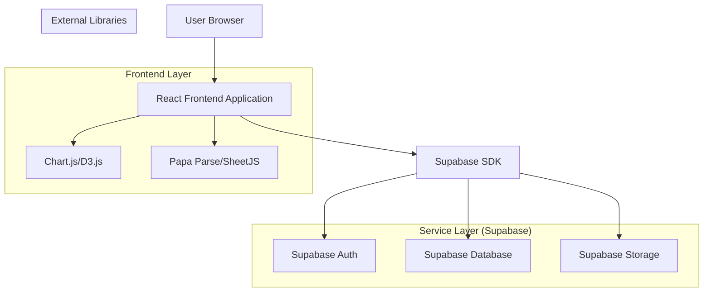
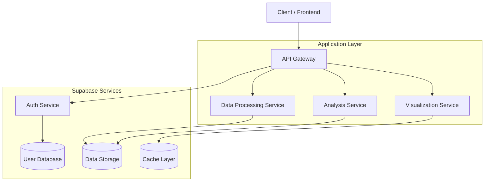
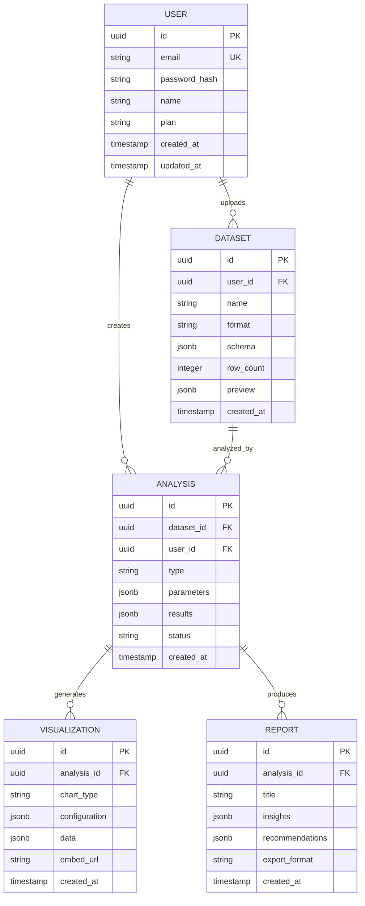

## 1. Architecture design



## 2. Technology Description
- Frontend: React@18 + tailwindcss@3 + vite
- Backend: Supabase (Database, Auth, Storage)
- Data Processing: Papa Parse for CSV, SheetJS for Excel
- Visualization: Chart.js for standard charts, D3.js for custom visualizations
- UI Components: HeadlessUI + Heroicons
- State Management: React Context + useReducer
- Data Validation: Zod schema validation

## 3. Route definitions
| Route | Purpose |
|-------|---------|
| / | Dashboard page, displays overview and recent analyses |
| /data-input | Data input page with multiple input methods |
| /analysis | Analysis workspace for data processing and insights |
| /visualization | Visualization studio for creating charts and dashboards |
| /reports | Reports page for generated insights and exports |
| /settings | User settings and account management |
| /login | Authentication page for user login |
| /register | Registration page for new users |
| /forgot-password | Password recovery page |

## 4. API definitions
### 4.1 Core API

Data upload and processing
```
POST /api/data/upload
```

Request:
| Param Name| Param Type  | isRequired  | Description |
|-----------|-------------|-------------|-------------|
| file      | File        | false       | CSV/Excel file for upload |
| text_data | string      | false       | Text input data |
| format    | string      | true        | Data format (csv, excel, text) |
| objective | string      | false       | Custom analysis objective |

Response:
| Param Name| Param Type  | Description |
|-----------|-------------|-------------|
| upload_id | string      | Unique identifier for the uploaded data |
| status    | string      | Processing status |
| preview   | object      | Data preview with column information |

### 4.2 Data Analysis API
```
POST /api/data/analyze
```

Request:
| Param Name| Param Type  | isRequired  | Description |
|-----------|-------------|-------------|-------------|
| upload_id | string      | true        | ID of uploaded data |
| analysis_type | string | true        | Type of analysis (statistical, correlation, trend) |
| parameters| object      | false       | Additional analysis parameters |

Response:
| Param Name| Param Type  | Description |
|-----------|-------------|-------------|
| results   | object      | Analysis results with insights |
| charts    | array       | Generated chart configurations |
| recommendations | array | Data-driven recommendations |

### 4.3 Visualization API
```
POST /api/visualization/create
```

Request:
| Param Name| Param Type  | isRequired  | Description |
|-----------|-------------|-------------|-------------|
| data_id   | string      | true        | ID of processed data |
| chart_type| string      | true        | Type of chart (bar, line, pie, scatter, heatmap) |
| config    | object      | true        | Chart configuration options |

Response:
| Param Name| Param Type  | Description |
|-----------|-------------|-------------|
| chart_id  | string      | Unique identifier for the chart |
| chart_data| object      | Chart data and configuration |
| embed_url | string      | Shareable embed URL |

## 5. Server architecture diagram


## 6. Data model

### 6.1 Data model definition


### 6.2 Data Definition Language

User Table (users)
```sql
-- create table
CREATE TABLE users (
    id UUID PRIMARY KEY DEFAULT gen_random_uuid(),
    email VARCHAR(255) UNIQUE NOT NULL,
    password_hash VARCHAR(255) NOT NULL,
    name VARCHAR(100) NOT NULL,
    plan VARCHAR(20) DEFAULT 'basic' CHECK (plan IN ('basic', 'premium', 'enterprise')),
    created_at TIMESTAMP WITH TIME ZONE DEFAULT NOW(),
    updated_at TIMESTAMP WITH TIME ZONE DEFAULT NOW()
);

-- create index
CREATE INDEX idx_users_email ON users(email);
CREATE INDEX idx_users_plan ON users(plan);

-- set up Row Level Security
ALTER TABLE users ENABLE ROW LEVEL SECURITY;
CREATE POLICY "Users can view own profile" ON users FOR SELECT USING (auth.uid() = id);
CREATE POLICY "Users can update own profile" ON users FOR UPDATE USING (auth.uid() = id);
```

Dataset Table (datasets)
```sql
-- create table
CREATE TABLE datasets (
    id UUID PRIMARY KEY DEFAULT gen_random_uuid(),
    user_id UUID NOT NULL REFERENCES users(id) ON DELETE CASCADE,
    name VARCHAR(255) NOT NULL,
    format VARCHAR(20) CHECK (format IN ('csv', 'excel', 'text')),
    schema JSONB,
    row_count INTEGER DEFAULT 0,
    preview JSONB,
    file_path VARCHAR(500),
    created_at TIMESTAMP WITH TIME ZONE DEFAULT NOW(),
    updated_at TIMESTAMP WITH TIME ZONE DEFAULT NOW()
);

-- create index
CREATE INDEX idx_datasets_user_id ON datasets(user_id);
CREATE INDEX idx_datasets_created_at ON datasets(created_at DESC);

-- set up Row Level Security
ALTER TABLE datasets ENABLE ROW LEVEL SECURITY;
CREATE POLICY "Users can view own datasets" ON datasets FOR SELECT USING (auth.uid() = user_id);
CREATE POLICY "Users can insert own datasets" ON datasets FOR INSERT WITH CHECK (auth.uid() = user_id);
CREATE POLICY "Users can update own datasets" ON datasets FOR UPDATE USING (auth.uid() = user_id);
CREATE POLICY "Users can delete own datasets" ON datasets FOR DELETE USING (auth.uid() = user_id);
```

Analysis Table (analyses)
```sql
-- create table
CREATE TABLE analyses (
    id UUID PRIMARY KEY DEFAULT gen_random_uuid(),
    dataset_id UUID NOT NULL REFERENCES datasets(id) ON DELETE CASCADE,
    user_id UUID NOT NULL REFERENCES users(id) ON DELETE CASCADE,
    type VARCHAR(50) NOT NULL,
    parameters JSONB,
    results JSONB,
    status VARCHAR(20) DEFAULT 'pending' CHECK (status IN ('pending', 'processing', 'completed', 'failed')),
    error_message TEXT,
    created_at TIMESTAMP WITH TIME ZONE DEFAULT NOW(),
    updated_at TIMESTAMP WITH TIME ZONE DEFAULT NOW()
);

-- create index
CREATE INDEX idx_analyses_dataset_id ON analyses(dataset_id);
CREATE INDEX idx_analyses_user_id ON analyses(user_id);
CREATE INDEX idx_analyses_status ON analyses(status);
CREATE INDEX idx_analyses_created_at ON analyses(created_at DESC);

-- set up Row Level Security
ALTER TABLE analyses ENABLE ROW LEVEL SECURITY;
CREATE POLICY "Users can view own analyses" ON analyses FOR SELECT USING (auth.uid() = user_id);
CREATE POLICY "Users can insert own analyses" ON analyses FOR INSERT WITH CHECK (auth.uid() = user_id);
CREATE POLICY "Users can update own analyses" ON analyses FOR UPDATE USING (auth.uid() = user_id);
```

Visualization Table (visualizations)
```sql
-- create table
CREATE TABLE visualizations (
    id UUID PRIMARY KEY DEFAULT gen_random_uuid(),
    analysis_id UUID NOT NULL REFERENCES analyses(id) ON DELETE CASCADE,
    chart_type VARCHAR(50) NOT NULL,
    configuration JSONB,
    data JSONB,
    embed_url VARCHAR(500),
    is_public BOOLEAN DEFAULT false,
    created_at TIMESTAMP WITH TIME ZONE DEFAULT NOW()
);

-- create index
CREATE INDEX idx_visualizations_analysis_id ON visualizations(analysis_id);
CREATE INDEX idx_visualizations_chart_type ON visualizations(chart_type);
CREATE INDEX idx_visualizations_public ON visualizations(is_public);

-- set up Row Level Security
ALTER TABLE visualizations ENABLE ROW LEVEL SECURITY;
CREATE POLICY "Users can view own visualizations" ON visualizations FOR SELECT USING (
    is_public = true OR 
    EXISTS (
        SELECT 1 FROM analyses 
        WHERE analyses.id = visualizations.analysis_id 
        AND analyses.user_id = auth.uid()
    )
);
CREATE POLICY "Users can insert own visualizations" ON visualizations FOR INSERT WITH CHECK (
    EXISTS (
        SELECT 1 FROM analyses 
        WHERE analyses.id = visualizations.analysis_id 
        AND analyses.user_id = auth.uid()
    )
);
```

-- Grant permissions for anon and authenticated roles
GRANT SELECT ON users TO anon;
GRANT SELECT ON users TO authenticated;
GRANT ALL PRIVILEGES ON datasets TO authenticated;
GRANT ALL PRIVILEGES ON analyses TO authenticated;
GRANT ALL PRIVILEGES ON visualizations TO authenticated;